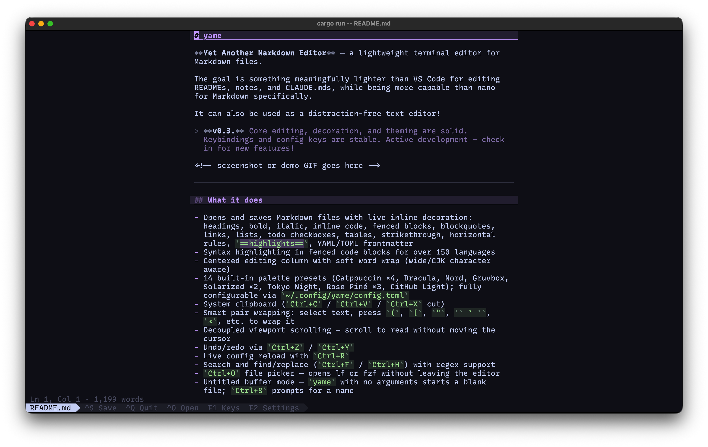
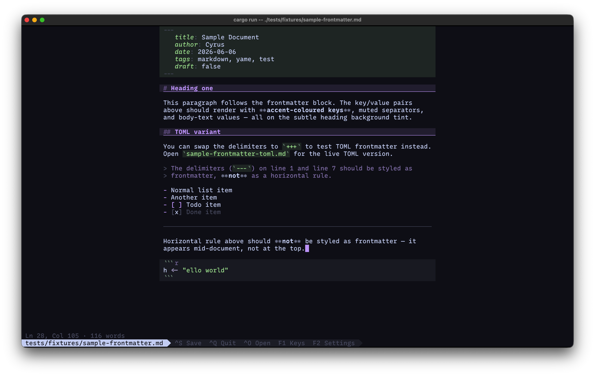
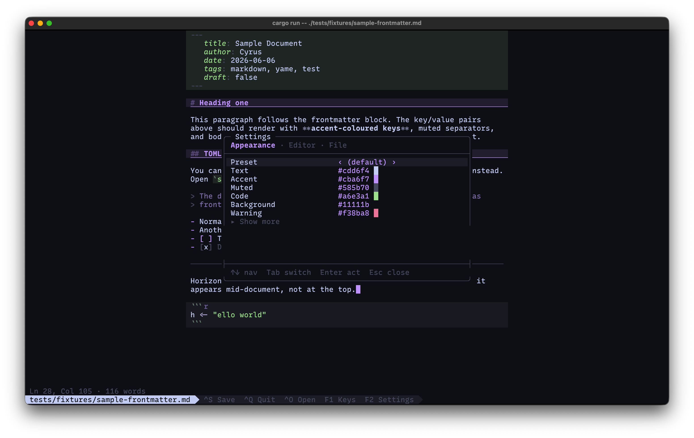

# yame

**Yet Another Markdown Editor** — a lightweight terminal editor for Markdown files.

The goal is something meaningfully lighter than VS Code for editing READMEs, notes, and documentation, while being more capable than nano for Markdown specifically.

It can also be used as a distraction-free text editor!

> **v1.0.0.** Core editing, decoration, and theming are solid. Keybindings and config keys are stable. Feature requests and issues are welcome!



---

## What it does

- Opens and saves Markdown files with live inline decoration: headings, bold, italic, inline code, fenced blocks, blockquotes, links, lists, todo checkboxes, tables, strikethrough, horizontal rules, `==highlights==`, YAML/TOML frontmatter
- Syntax highlighting in fenced code blocks for over 150 languages
- Centered editing column with soft word wrap (wide/CJK character aware)
- 14 built-in palette presets (Catppuccin ×4, Dracula, Nord, Gruvbox, Solarized ×2, Tokyo Night, Rose Piné ×3, GitHub Light); fully configurable via `~/.config/yame/config.toml` or in-app settings menu
- System clipboard (`Ctrl+C` / `Ctrl+V` / `Ctrl+X` cut)
- Smart pair wrapping: select text, press `(`, `[`, `"`, `` ` ``, `*`, etc. to wrap it
- Auto-close pairs (opt-in): typing `(` inserts `()` with the cursor between; typing `)` when already before one skips over it instead of duplicating; same for `[ ] { } " ' \` * _`
- Decoupled viewport scrolling — scroll to read without moving the cursor
- Undo/redo via `Ctrl+Z` / `Ctrl+Y`
- Live config reload with `Ctrl+R`; live in-app settings editor
- Search and find/replace (`Ctrl+F` / `Ctrl+H`) with regex support
- `Ctrl+O` file picker — opens lf or fzf without leaving the editor
- Untitled buffer mode — `yame` with no arguments starts a blank file; `Ctrl+S` prompts for a name
- `yame --preview <file>` — headless ANSI render for lf/file-manager previewers
- Optional line numbers, focus mode, and typewriter mode

## What it doesn't do right now

- No tab completion or split panes



---

## Install

```sh
cargo install yame
```

Or build from source:

```sh
git clone https://github.com/cyrusae/yame
cd yame
cargo install --path .
```

### Platform support

Tested on macOS and Linux. Should work on Windows; untested. Issues and pull requests welcome.

---

## Usage

```
yame <file>           Open <file> for editing (created if it doesn't exist)
yame                  Open an untitled buffer (Ctrl+S prompts for a filename)
yame -r <file>        Open <file> in read-only mode (no edits, no save)
yame --preview <file> Render <file> to stdout with ANSI colour (for lf previewer)
yame init             Print shell integration function for your shell
yame write-config     Write a commented default config to ~/.config/yame/config.toml
yame --help           Show help
```

### Shell integration (optional)

`yame init` prints a shell function that adds fuzzy file discovery. Add this line to your `.bashrc` or `.zshrc`:

```bash
eval "$(yame init)"
```

This checks your login shell; to specify a shell, use `yame init bash` or `yame init zsh`. 

Once active, `yame` with no argument fuzzy-finds Markdown files in the current directory; `yame <term>` fuzzy-searches by name; `yame path/to/file.md` passes through directly.

**Requires [`fd`](https://github.com/sharkdp/fd) and [`fzf`](https://github.com/junegunn/fzf).**

<details>
<summary>Manual alternative (without <code>yame init</code>)</summary>

```bash
yame() {
  local target
  if [[ -z "$1" ]]; then
    target=$(fd --type f --extension md | fzf --select-1 --exit-0 --preview 'head -20 {}')
  elif [[ "$1" == */* || "$1" == *.* ]]; then
    target="$1"
  else
    target=$(fd --type f "$1" | fzf --select-1 --exit-0 --preview 'head -20 {}')
  fi
  [[ -n "$target" ]] && command yame "$target"
}
```

Without `fd`, replace `fd --type f --extension md` with `find . -name "*.md"`.

</details>

---

## Keybindings

| Key | Action |
| --- | --- |
| `Ctrl+S` | Save |
| `Ctrl+Q` · `Esc` | Quit (prompts if unsaved changes) |
| `Ctrl+Z` | Undo |
| `Ctrl+Y` | Redo |
| `Ctrl+C` | Copy selection |
| `Ctrl+X` | Cut selection |
| `Ctrl+V` | Paste from system clipboard |
| `Ctrl+O` | Open file picker (lf → fzf → `$YAME_PICKER`) |
| `Ctrl+K` | Insert fenced code block |
| `Ctrl+R` | Reload config file |
| `Ctrl+E` | Toggle read-only mode |
| `Ctrl+F` | Search |
| `Ctrl+H` | Find & replace |
| `Ctrl+G` | Go to line |
| `Ctrl+T` | Toggle typewriter mode |
| `Ctrl+D` | Toggle focus mode |
| `Alt+T` | Reformat GFM table |
| `F1` | Keybinding reference (in-app cheatsheet) |
| `F2` | Settings modal (in-app UI) |
| Arrow keys | Move cursor |
| `Shift+Arrow` | Select text |
| `Ctrl+A` | Select all |
| `Home` / `End` | Start / end of line |
| `PgUp` / `PgDn` | Scroll by page |
| `Ctrl+Up` / `Ctrl+Down` | Scroll viewport without moving cursor |
| Mouse click | Place cursor |
| Mouse drag | Select text |
| Mouse scroll | Scroll viewport |

---

## Configuration

Config file: `~/.config/yame/config.toml`
(Respects `$XDG_CONFIG_HOME` if set.)

The file is optional. Run `yame write-config` to write a fully-commented template to the default path. All values below are the defaults (Catppuccin Mocha). You can set any subset — missing keys fall back to the default.

### Palette presets

Switch to a built-in palette by name:

```toml
[palette]
preset = "dracula"
```

Available presets: `catppuccin-mocha` (default), `catppuccin-latte`, `catppuccin-frappe`, `catppuccin-macchiato`, `dracula`, `nord`, `gruvbox-dark`, `solarized-dark`, `solarized-light`, `tokyo-night`, `rose-pine`, `rose-pine-moon`, `rose-pine-dawn`, `github-light`.

Append `-expanded` to any name (e.g. `"dracula-expanded"`) for rainbow per-level heading colors and a per-theme italic tint.

See [`_info/THEMES.md`](_info/THEMES.md) for the full preset list, override order, and per-element reference.

### Base palette

```toml
[palette]
# preset  = "catppuccin-mocha"   # switch to any named preset (see above)
# text    = "#cdd6f4"   # body text
# accent  = "#cba6f7"   # headings, links, bullets
# muted   = "#585b70"   # blockquotes, URLs, completed todos
# code    = "#a6e3a1"   # inline code and fenced blocks
# bg      = "#11111b"   # editor background
# warning = "#f38ba8"   # dirty flag, warnings
```

Setting these six colors gives you a coherent theme. All other colors derive from them automatically. Individual fields override the preset when both are set.



### Theme overrides

Optional per-element overrides. These take precedence over the derived defaults.

```toml
[theme]
# bold_color          = "#cdd6f4"
# italic_color        = "#f5c2e7"   # e.g. Catppuccin pink for tonal distinction
# strikethrough_color = "#585b70"   # ~~struck~~ text (default: muted)
# blockquote_color    = "#6c7086"
# link_text_color     = "#cba6f7"
# link_url_color      = "#6c7086"
# todo_done           = "#585b70"   # completed todo items
# rule_color          = "#585b70"   # horizontal rule ─────
# code_bg             = "#262637"
# fenced_bg           = "#222233"
# heading_bg          = "#302d45"
# selection_bg        = "#413d5c"
# selection_fg        = "#1e1e2e"
# ui_bg               = "#1e1e2e"
# ui_bar              = "#313244"
# ui_text             = "#cdd6f4"
# delimiter_blend     = 0.4         # 0.0 = full muted, 1.0 = full span color
# highlight_bg        = "#524568"   # ==text== background (accent at 35% — try "#816a9f" for bolder)
# highlight_fg        = "#cdd6f4"   # ==text== foreground
# frontmatter_key     = "#a6e3a1"   # YAML/TOML frontmatter key color (default: code green)
# frontmatter_bg      = "#1e2620"   # YAML/TOML frontmatter block background (default: code at 15%)
```

### Per-level heading colors

```toml
[headings]
# h1 = "#cba6f7"
# h2 = "#89b4fa"
# h3 = "#94e2d5"
# h4 = "#a6e3a1"
# h5 = "#f5c2e7"
# h6 = "#fab387"
```

### Layout

```toml
[layout]
# min_cols          = 60     # minimum editing column width in characters
# max_cols          = 88     # maximum editing column width — caps the prose wrap margin on wide terminals
# tab_width         = 4      # spaces per tab character (tabs are expanded on load)
# line_numbers      = false  # set true to show line numbers in the left gutter
# powerline_glyphs  = true   # set false to use the universal │ separator instead
# auto_close_pairs  = false  # set true to auto-insert closing delimiters: ( → (), [ → [], " → "", etc.
```

> **Note:** Nerd Font arrow separators are on by default. If your terminal font doesn't include glyph U+E0B0 and the status bar shows a box character, add `powerline_glyphs = false` to your config. 
> 
> A [Nerd Fonts](https://www.nerdfonts.com/) patched font (or a font with built-in Powerline support such as Cascadia Code or JetBrains Mono) will render them correctly.

### Error handling

If the config file has invalid TOML, yame falls back to defaults and prints a warning to stderr. If an individual color value is malformed, that field falls back to its default and a dismissible warning banner appears at the top of the editor.

### How do you pronounce it?

Think "Se llame *yame*."

---

## License

MIT
